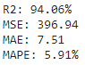
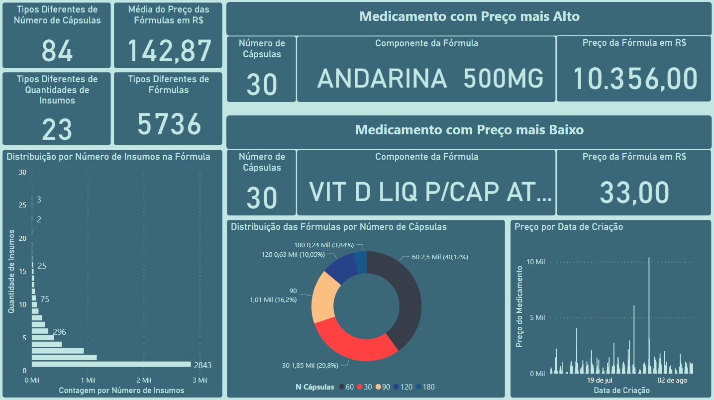

# Análise Manipulaê

## Descrição das Atividades realizadas

### Pré-processamento e Análise

Foi feita uma análise exploratória inicial para avaliar bem como os dados estavam definidos, também foi feita uma verificação da integridade das informações, com o intuito de constatar se haviam dados faltantes.

Houve um processo de feature engineering para criação de novas variáveis que auxiliaram na predição do valor correto do preço das receitas. Uma das principais alterações foi a separação da descrição das receitas.

### Machine Learning

Foram usados dois modelos para o processo de aprendizagem, os quais foram o GradientBoosting e CatBoosting. Assim, no final foi feito um ensemble entre os dois modelos para aprimorar mais ainda a predição. Para chegar no melhor resultado de cada modelo houve um processo de GridSearch para encontrar os melhores parâmetros.

### Validação

Os resultados obtidos foram constantemente incrementados ao longo do estudo dos dados, chegando a mais de 90% de R2_Score, por exemplo. Alguns resultados bem interessantes também foram observados fazendo um avaliação de algumas faixas de valores específicas, como um Erro médio absoluto de aproximadamente R$ 3.00. Mas os seguintes resultados foram obtidos para o conjunto total dos dados:

## Métricas de avaliação
- R2_Score
- MSE
- RMSE
- MAE
- MAPE

Como foi supracitado, para algumas faixas de valores os resultados são ainda melhores, nesse caso, temos a faixa de 30 a 400 reais, onde as métricas são ainda mais precisas.

## Dashboard do Dataset

